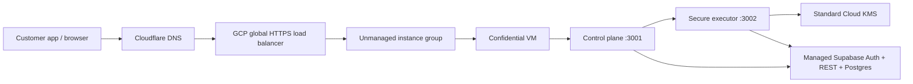

# VaultProof GCP Full Buildout Plan

Last updated: 2026-05-10

This is the customer-demo buildout plan for moving VaultProof Enterprise from the current GCP pilot into a credible demo path that can support near-term customer conversations.

The plan keeps the first customer launch deliberately narrow: one shared GCP production runtime, standard Cloud KMS, one public HTTPS edge for `enterprise.vaultproof.dev`, strong readiness gates, and a repeatable onboarding runbook. No HSM is included in this buildout.

Database/auth decision for Goal 1: keep managed Supabase for the demo. Do not move the demo database to Cloud SQL, AlloyDB, or self-hosted Supabase yet, because VaultProof currently depends on Supabase Auth/OAuth/session handling, Admin Auth APIs, REST/service-role APIs, `auth.users`, and Supabase migrations. We can start fresh later after the demo. See `docs/enterprise/gcp-supabase-decision.md`.

## Current Baseline

Already built:

- GCP project: `vaultproof-prod`
- Region: `us-central1`
- Bootstrap Confidential VM: `vaultproof-enterprise-runtime-1`
- Artifact Registry images for control plane and secure executor
- Standard Cloud KMS unwrap key: `vaultproof-unwrap`
- Secret Manager containers for runtime env bundles
- Secret Manager origin-lock value: `enterprise-origin-lock-secret`
- IAP-only SSH access to the VM
- Public GCP HTTPS load balancer for `enterprise.vaultproof.dev`
- Cloudflare A record for `enterprise.vaultproof.dev` pointing to `34.102.179.105`
- Google-managed TLS certificate for `enterprise.vaultproof.dev`, status `ACTIVE`
- Load-balancer backend custom origin-lock header injection
- Cloud Armor edge policy helper for WAF-style scanner blocking and coarse per-IP rate limits
- Customer launch checklist page at `/app/launch`
- Build-status and feature inventory docs
- Managed Supabase remains the auth/database provider for the pilot

Not yet customer-ready:

- Strict login readiness QA and final human OAuth/password browser QA still need to pass.
- Live MiniMax provider dispatch works for the demo; add a separate OpenAI slot only if the demo specifically needs OpenAI.
- Supabase OAuth/login settings still need to be confirmed for `enterprise.vaultproof.dev`.
- Older migration/history docs still have Azure-era language; customer-facing app UI is cleaned for the GCP demo.

## Launch Goal

Get to a credible first paid-customer pilot quickly:

- Customer can open `https://enterprise.vaultproof.dev`.
- Control plane `/health` is public and stable.
- Control plane `/readiness` is available as customer-facing evidence.
- Executor runs inside the Confidential VM and never exposes a public port.
- Requests go through the control plane to the executor over localhost.
- KMS unwrap material is decrypted only by the executor service account.
- Secret Manager owns all runtime secrets.
- Customer onboarding has one repeatable checklist.

## Goal 1: Testable Paid Pilot

Goal 1 is the first milestone where Ken can start testing the sellable product path. It is done only when:

- `npm run gate:gcp-first-goal` returns `status: done`.
- `/readiness` reports `production_ready: true`.
- Readiness reports `security_profile: google-confidential-production`.
- A first pilot organization, member, project, and provider slot exist.
- A dry-run execute request proves control plane -> executor -> policy -> audit flow.

Current status: Goal 1 demo dry-run gate is done. The control-plane runtime env includes the public Supabase anon key. `npm run qa:enterprise-login` now exists for repeatable login readiness checks; strict mode still needs to be run with Supabase service-role env, then followed by final human OAuth/password browser QA.

## Architecture



The executor stays private. Only the load balancer can reach the VM control-plane port. SSH remains IAP-only.

## Current Phase Status

| Phase | Status | Notes |
| --- | --- | --- |
| Phase 1: Public Edge | Complete | DNS, TLS, forwarding rule, backend health, restricted LB firewall, and `/health` pass. |
| Phase 2: Runtime Secrets And Readiness | Complete for demo | Real control-plane/executor env versions are published and live readiness reports `production_ready: true`. |
| Phase 3: DNS Cutover | Complete for `enterprise` | Cloudflare `enterprise` A record points to `34.102.179.105`; TLS is active. |
| Phase 4: Demo Readiness | In progress | Live gate passed for dry-run demo data; login readiness tooling is built; strict login QA, human browser login QA, and Supabase OAuth/Auth redirect confirmation remain. |
| Phase 5: Customer Scale | Started | Cloud Armor WAF/rate-limit helper is built; managed instance group, monitoring policies, evidence automation, and rollback still remain. |

## Cost Snapshot

Current fixed idle run rate is roughly `$85-$90/month` before customer traffic, Cloud Logging volume, and Supabase. The largest fixed items are the always-on `n2d-standard-2` Confidential VM and the global HTTPS forwarding rule.

The existing USD 50 budget is useful as an early warning, but it is below the expected always-on pilot run rate. For a customer pilot, either raise the alert, stop the VM outside demos, or do a cost pass before launch.

## Phase 1: Public Edge

Status: complete for the shared pilot edge.

Build:

- Reserve a global static IPv4 address.
- Create a global Google-managed HTTPS certificate for `enterprise.vaultproof.dev`.
- Add the bootstrap VM to a zonal unmanaged instance group.
- Create an HTTP health check on `/health`, port `3001`.
- Create a global backend service with logging enabled.
- Open firewall only from Google load-balancer and health-check source ranges to TCP `3001`.
- Create a URL map, target HTTPS proxy, TLS policy, and global forwarding rule on port `443`.
- Keep Cloudflare DNS-only for `enterprise.vaultproof.dev` through readiness QA; consider proxying only after origin-lock enforcement and live app QA pass.

Success:

- `gcloud compute backend-services get-health vaultproof-enterprise-backend --global` shows the VM backend healthy.
- `curl --resolve enterprise.vaultproof.dev:443:<edge-ip> https://enterprise.vaultproof.dev/health` works once the certificate is active.
- No public firewall rule exposes port `3001` to the open internet.

## Phase 2: Runtime Secrets And Readiness

Status: next active build phase.

Build:

- Decide unwrap-root strategy:
  - migrate the existing root into GCP KMS ciphertext, or
  - start with fresh demo/customer pilot data.
- Add a real executor env secret version.
- Add a real control-plane env secret version.
- Use `npm run publish:gcp-enterprise-secrets` so the publish step validates required env keys and rejects bootstrap placeholders.
- Set `ENTERPRISE_CLOUD_PROVIDER=gcp`.
- Set `ENTERPRISE_REQUIRE_ORIGIN_LOCK=true` after the load balancer custom header is configured.
- Restart or recreate the VM so it loads latest secrets.

Success:

- Executor `/health` reports `production_ready: true`.
- Control plane `/readiness` reports `production_ready: true`.
- Readiness shows `security_profile: google-confidential-production`.
- GCP KMS key protection level is `SOFTWARE`, not HSM.

## Phase 3: DNS Cutover

Status: complete for `enterprise.vaultproof.dev`; keep Cloudflare DNS-only until production readiness and final QA are clean.

DNS authority today:

- `vaultproof.dev` nameservers are Cloudflare: `cris.ns.cloudflare.com` and `gracie.ns.cloudflare.com`.

Built:

- Cloudflare A record:
  - name: `enterprise`
  - value: `34.102.179.105`
  - proxy mode: DNS-only
- Google-managed certificate status is active.
- Public smoke checks against `https://enterprise.vaultproof.dev/health` pass.

Success:

- `dig +short enterprise.vaultproof.dev` returns the GCP edge IP.
- TLS is valid for `enterprise.vaultproof.dev`.
- `/health`, `/readiness`, `/app/login`, and `/app/dashboard` render without mixed Azure/GCP claims.

## Phase 4: Demo Readiness

Build:

- Create one demo organization in Supabase.
- Create one demo project with strict origin/caller policy.
- Confirm provider slots and allowed origins.
- Seed a demo provider slot. Placeholder shares are acceptable for dashboard and dry-run validation; live provider dispatch later needs encrypted shares generated from the same unwrap root encrypted into GCP KMS.
- Run `LOGIN_QA_REQUIRE_SESSION=true npm run qa:enterprise-login` with Supabase service-role env to verify the live login page, Supabase redirect allowlist, generated browser session, and authenticated enterprise org/bootstrap APIs.
- Add `LOGIN_QA_OAUTH_PROVIDER=google` to the login QA command after the external OAuth provider app is configured.
- Confirm API execution path through `/api/v1/enterprise/execute`.
- Prepare demo talking points and one-page security proof.

Success:

- Ken can log in or use a guided demo account.
- Test execution succeeds without exposing provider keys to the customer app.
- Audit export shows request, policy, executor, and attestation metadata.
- Support/admin path is available internally.

## Phase 5: Customer Scale

Build after first customer proof:

- Move from one bootstrap VM to a managed instance group or blue/green VM pair.
- Add Cloud Armor WAF and rate limits. Status: helper built with scanner-path blocking plus per-IP throttles for secure execute, enterprise APIs, and the public edge.
- Add uptime checks and alerting policies.
- Add automated evidence bundle capture for each release.
- Add a rollback script for edge, VM image, and DNS changes.
- Clean older Azure migration/history docs into provider-neutral or clearly archived references before paid-production handoff.

## Customer Launch Checklist

- Public edge built.
- DNS points to GCP.
- TLS certificate active.
- Secrets are real and current.
- `/readiness` is production-ready.
- Executor unwrap ciphertext configured.
- Attestation hash and measurement summary configured.
- Supabase org/project/user data seeded.
- Customer-facing docs reviewed for Azure-era leftovers.
- Budget and monitoring reviewed daily during launch week.
- Cloud Armor policy is attached and `npm run verify:gcp-enterprise-cloud-armor` passes.
- Customer launch checklist at `/app/launch` is reviewed with the pilot user.
- Rollback path written down before sending real customer traffic.

## Operating Rules

- Do not enable Cloud HSM for the shared pilot.
- Do not point DNS at a degraded runtime.
- Do not claim production-ready unless `/readiness` is production-ready.
- Do not deploy a different unwrap root against existing encrypted customer data.
- Keep the executor private.
- Use Cloudflare only for DNS cutover unless a Cloudflare API token is explicitly provided.

## Repo Commands

```bash
npm run provision:gcp-enterprise-core
npm run build:gcp-enterprise-images
npm run deploy:gcp-enterprise-vm
npm run configure:gcp-enterprise-edge
npm run configure:gcp-enterprise-cloud-armor
npm run verify:gcp-enterprise-cloud-armor
npm run collect:gcp-runtime-evidence
npm run prepare:gcp-first-goal-runtime
npm run publish:gcp-enterprise-secrets
npm run verify:gcp-enterprise-edge
npm run gate:gcp-first-goal
npm run gate:gcp-customer-launch
npm run docs:gcp-build-status
```

## Source References

- Google Cloud external HTTPS load balancing: https://cloud.google.com/load-balancing/docs/https
- Google-managed load-balancer certificates: https://cloud.google.com/load-balancing/docs/ssl-certificates/google-managed-certs
- Cloud DNS records: https://cloud.google.com/dns/docs/records
