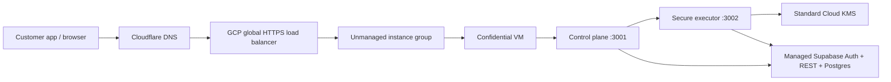

# VaultProof GCP Full Buildout Plan

Last updated: 2026-05-14

This is the customer-demo buildout plan for moving VaultProof Enterprise from the current GCP pilot into a credible demo path that can support near-term customer conversations.

The plan keeps the first customer launch deliberately narrow: one shared GCP production runtime, standard Cloud KMS, one public HTTPS edge for `enterprise.vaultproof.dev`, strong readiness gates, and a repeatable onboarding runbook. No HSM is included in this buildout.

Database/auth decision for Goal 1: keep managed Supabase for the demo. Do not move the demo database to Cloud SQL, AlloyDB, or self-hosted Supabase yet, because VaultProof currently depends on Supabase Auth/OAuth/session handling, Admin Auth APIs, REST/service-role APIs, `auth.users`, and Supabase migrations. We can start fresh later after the demo. See `docs/enterprise/gcp-supabase-decision.md`.

## Current Baseline

Already built:

- GCP project: `vaultproof-prod`
- Region: `us-central1`
- Bootstrap Confidential VM: `vaultproof-enterprise-runtime-1`
- Artifact Registry images for control plane and secure executor
- Standard Cloud KMS unwrap key: `vaultproof-unwrap`
- Secret Manager containers for runtime env bundles
- Secret Manager origin-lock value: `enterprise-origin-lock-secret`
- IAP-only SSH access to the VM
- Public GCP HTTPS load balancer for `enterprise.vaultproof.dev`
- Cloudflare A record for `enterprise.vaultproof.dev` pointing to `34.102.179.105`
- Google-managed TLS certificate for `enterprise.vaultproof.dev`, status `ACTIVE`
- Load-balancer backend custom origin-lock header injection
- Cloud Armor edge policy helper for WAF-style scanner blocking and coarse per-IP rate limits
- Staff demo script page at `https://admin.vaultproof.dev/app/demo` for buyer walkthrough, proof path, guardrails, Q&A, and close steps
- Staff-only launch checklist page at `https://admin.vaultproof.dev/app/launch`, including safe-to-pilot go/no-go board with browser-local operator evidence status, timestamps, and stale holds; `https://enterprise.vaultproof.dev/app/launch` is intentionally removed from the customer host
- Customer evidence packet page at `https://enterprise.vaultproof.dev/app/evidence`, including go/no-go launch decision summary and blockers
- Customer release evidence center at `https://enterprise.vaultproof.dev/app/release` for build/image tag, approver, verifier, rollout state, rollback owner/path, and customer-safe release proof
- Staff launch support room at `https://admin.vaultproof.dev/app/support` for support model, internal admin boundary, approval gates, handoff checklist, and copyable support brief
- Customer security review packet at `https://enterprise.vaultproof.dev/app/security-review` for architecture, controls, evidence links, open items, common buyer answers, known limitations, and secret exclusions
- Buyer commercial package page at `https://enterprise.vaultproof.dev/app/plans` for paid-pilot scope, included controls, contract guardrails, security boundaries, and customer review links
- Paid-user entitlements page at `https://enterprise.vaultproof.dev/app/entitlements` for contract status, capacity envelope, billing owner, success owner, support tier, renewal/review date, incident-response boundary, and customer-safe JSON proof
- Staff paid-customer onboarding board at `https://admin.vaultproof.dev/app/onboarding` for activation owners, enterprise login handoff, first workload scope, support handoff, capacity/renewal review, key posture, customer testing window, and customer-safe JSON proof
- Paid-pilot proposal builder at `https://enterprise.vaultproof.dev/app/pilot` for first workload scope, expected volume, monthly price, sales commission math, support boundary, incident-response terms, success metric, and close steps
- Staff pilot success tracker at `https://admin.vaultproof.dev/app/pilot-success` for live checks, browser-local milestones, evidence links, blockers, weekly customer update copy, and expansion/no-go readiness
- Paid-pilot tester readiness board at `https://enterprise.vaultproof.dev/app/testers` for browser-local tester roster, login/scenario status, scenario assignment, customer-safe feedback, blockers, and JSON evidence
- Staff admin console at `https://admin.vaultproof.dev` in code for creating enterprise businesses, finding/inviting the first owner, seeding SSO metadata, adding users, and copying per-business login links; `enterprise.vaultproof.dev` remains customer-only
- API inventory board at `https://enterprise.vaultproof.dev/app/inventory` for metadata-only API catalog rows derived from projects, provider slots, caller-lock policy, traffic rollups, browser-local owner/risk/review annotations, and customer-safe JSON evidence
- Build-status and feature inventory docs
- Managed Supabase remains the auth/database provider for the pilot
- Policy drift and exceptions board at `https://enterprise.vaultproof.dev/app/policy` for customer-safe control-gap rows, browser-local accepted-risk records, owner/risk/expiry metadata, compensating controls, and JSON evidence
- Integration rollout manager at `https://enterprise.vaultproof.dev/app/rollout` for workload cutover rows, app/gateway owners, integration mode, target date, support window, canary status, rollback path, blockers, copy-safe snippets, and JSON evidence
- Scanner exposure intake at `https://enterprise.vaultproof.dev/app/scanner` for redacted repository exposure findings, owners, rotation/remediation status, provider-slot hints, and customer-safe JSON evidence

Not yet customer-ready:

- Strict login readiness QA and final human OAuth/password browser QA still need to pass.
- Email API key demo dry-run and blocked-recipient policy evidence flow are built; live sandbox email sends need sealed provider material only if the demo specifically needs an actual delivered email.
- Live MiniMax provider dispatch works for the demo; add a separate OpenAI slot only if the demo specifically needs OpenAI.
- API inventory management now has browser-local CSV/OpenAPI JSON import for demo metadata; it still needs persistent audited records, durable imports, automatic discovery, and production review workflow after the demo.
- Scanner exposure intake still needs persistent audited records, CI/scanner imports, automatic discovery, and PR/remediation workflows after the demo.
- Release evidence still needs persistent audited records, automated Cloud Build/deploy evidence capture, approval workflow, and rollback automation after the demo.
- Paid-pilot tester readiness still needs persistent audited records, invite automation, scenario-specific feedback forms, and durable owner handoff after the demo.
- Paid-user entitlements are browser-local for the demo; durable contract source-of-truth, billing API integration, hard limit enforcement, invoice status, and audited amendment history remain follow-up work.
- Paid-customer onboarding is browser-local for the demo; persistent audited activation records, invite automation, customer task notifications, and staff-admin activation workflow remain follow-up work.
- Supabase OAuth/login settings still need to be confirmed for `enterprise.vaultproof.dev`.
- `admin.vaultproof.dev` still needs live edge/DNS/certificate verification before staff should use it in production.
- Older migration/history docs still have Azure-era language; customer-facing app UI is cleaned for the GCP demo.

## Launch Goal

Get to a credible first paid-customer pilot quickly:

- Customer can open `https://enterprise.vaultproof.dev`.
- Control plane `/health` is public and stable.
- Control plane `/readiness` is available as customer-facing evidence.
- Executor runs inside the Confidential VM and never exposes a public port.
- Requests go through the control plane to the executor over localhost.
- KMS unwrap material is decrypted only by the executor service account.
- Secret Manager owns all runtime secrets.
- Customer onboarding has one repeatable checklist.

## Goal 1: Testable Paid Pilot

Goal 1 is the first milestone where Ken can start testing the sellable product path. It is done only when:

- `npm run gate:gcp-first-goal` returns `status: done`.
- `/readiness` reports `production_ready: true`.
- Readiness reports `security_profile: google-confidential-production`.
- A first pilot organization, member, project, and provider slot exist.
- A dry-run execute request proves control plane -> executor -> policy -> audit flow.

Current status: Goal 1 demo dry-run gate is done. The control-plane runtime env includes the public Supabase anon key. `npm run qa:enterprise-login` now exists for repeatable login readiness checks; strict mode still needs to be run with Supabase service-role env, then followed by final human OAuth/password browser QA.

Customer packaging status: customer-facing buyer pages are on `https://enterprise.vaultproof.dev`, while staff-only demo, onboarding, support, pilot-success, and launch controls are on `https://admin.vaultproof.dev`. `https://enterprise.vaultproof.dev/app/plans` now carries the first sellable paid-pilot package view, `https://enterprise.vaultproof.dev/app/entitlements` records paid-user contract status, capacity, owners, support tier, renewal date, and incident-response boundary, `https://admin.vaultproof.dev/app/onboarding` turns accepted entitlements into activation owners, login handoff, first workload scope, support handoff, key posture, and testing-window evidence, `https://enterprise.vaultproof.dev/app/security-review` gives buyers a copyable security/procurement review packet, `https://enterprise.vaultproof.dev/app/release` records build/approval/verification/rollback proof after each deploy, `https://enterprise.vaultproof.dev/app/testers` prepares the paid-pilot tester roster and guided-session evidence, `https://enterprise.vaultproof.dev/app/pilot` creates the first-workload proposal with price, commission, support, incident-response, and close-step terms, and `https://admin.vaultproof.dev/app/pilot-success` tracks weekly proof, milestones, blockers, and expansion/no-go readiness after kickoff. It keeps automated billing and hard plan enforcement out of scope for Goal 1; capacity, support cadence, retention, SSO depth, and dedicated-runtime terms stay contract-controlled until billing APIs exist.

## Architecture



The executor stays private. Only the load balancer can reach the VM control-plane port. SSH remains IAP-only.

## Current Phase Status

| Phase | Status | Notes |
| --- | --- | --- |
| Phase 1: Public Edge | Complete | DNS, TLS, forwarding rule, backend health, restricted LB firewall, and `/health` pass. |
| Phase 2: Runtime Secrets And Readiness | Complete for demo | Real control-plane/executor env versions are published and live readiness reports `production_ready: true`. |
| Phase 3: DNS Cutover | Complete for `enterprise` | Cloudflare `enterprise` A record points to `34.102.179.105`; TLS is active. |
| Phase 4: Demo Readiness | In progress | Live gate passed for dry-run demo data; login readiness tooling is built; strict login QA, human browser login QA, and Supabase OAuth/Auth redirect confirmation remain. |
| Phase 5: Customer Scale | Started | Cloud Armor WAF/rate-limit helper is built; managed instance group, monitoring policies, evidence automation, and rollback still remain. |

## Cost Snapshot

Current fixed idle run rate is roughly `$85-$90/month` before customer traffic, Cloud Logging volume, and Supabase. The largest fixed items are the always-on `n2d-standard-2` Confidential VM and the global HTTPS forwarding rule.

The existing USD 50 budget is useful as an early warning, but it is below the expected always-on pilot run rate. For a customer pilot, either raise the alert, stop the VM outside demos, or do a cost pass before launch.

## Phase 1: Public Edge

Status: complete for the shared pilot edge.

Build:

- Reserve a global static IPv4 address.
- Create a global Google-managed HTTPS certificate for `enterprise.vaultproof.dev`.
- Add the bootstrap VM to a zonal unmanaged instance group.
- Create an HTTP health check on `/health`, port `3001`.
- Create a global backend service with logging enabled.
- Open firewall only from Google load-balancer and health-check source ranges to TCP `3001`.
- Create a URL map, target HTTPS proxy, TLS policy, and global forwarding rule on port `443`.
- Keep Cloudflare DNS-only for `enterprise.vaultproof.dev` through readiness QA; consider proxying only after origin-lock enforcement and live app QA pass.

Success:

- `gcloud compute backend-services get-health vaultproof-enterprise-backend --global` shows the VM backend healthy.
- `curl --resolve enterprise.vaultproof.dev:443:<edge-ip> https://enterprise.vaultproof.dev/health` works once the certificate is active.
- No public firewall rule exposes port `3001` to the open internet.

## Phase 2: Runtime Secrets And Readiness

Status: next active build phase.

Build:

- Decide unwrap-root strategy:
  - migrate the existing root into GCP KMS ciphertext, or
  - start with fresh demo/customer pilot data.
- Add a real executor env secret version.
- Add a real control-plane env secret version.
- Use `npm run publish:gcp-enterprise-secrets` so the publish step validates required env keys and rejects bootstrap placeholders.
- Set `ENTERPRISE_CLOUD_PROVIDER=gcp`.
- Set `ENTERPRISE_REQUIRE_ORIGIN_LOCK=true` after the load balancer custom header is configured.
- Restart or recreate the VM so it loads latest secrets.

Success:

- Executor `/health` reports `production_ready: true`.
- Control plane `/readiness` reports `production_ready: true`.
- Readiness shows `security_profile: google-confidential-production`.
- GCP KMS key protection level is `SOFTWARE`, not HSM.

## Phase 3: DNS Cutover

Status: complete for `enterprise.vaultproof.dev`; keep Cloudflare DNS-only until production readiness and final QA are clean.

DNS authority today:

- `vaultproof.dev` nameservers are Cloudflare: `cris.ns.cloudflare.com` and `gracie.ns.cloudflare.com`.

Built:

- Cloudflare A record:
  - name: `enterprise`
  - value: `34.102.179.105`
  - proxy mode: DNS-only
- Google-managed certificate status is active.
- Public smoke checks against `https://enterprise.vaultproof.dev/health` pass.

Success:

- `dig +short enterprise.vaultproof.dev` returns the GCP edge IP.
- TLS is valid for `enterprise.vaultproof.dev`.
- `/health`, `/readiness`, `https://enterprise.vaultproof.dev/app/login`, and `https://enterprise.vaultproof.dev/app/dashboard` render without mixed Azure/GCP claims.

## Phase 4: Demo Readiness

Build:

- Create one demo organization in Supabase.
- Create one demo project with strict origin/caller policy.
- Confirm provider slots and allowed origins.
- Seed a demo provider slot. Placeholder shares are acceptable for dashboard and dry-run validation; live provider dispatch later needs encrypted shares generated from the same unwrap root encrypted into GCP KMS.
- Use the email API key protection demo flow described below.
- Built: add the first API inventory management slice described below.
- Built: add the first policy drift and exceptions slice described below.
- Built: add the first integration rollout manager slice described below.
- Built: add the first release evidence slice described below.
- Built: add the first paid-user entitlements slice described below.
- Built: add the first paid-customer onboarding slice described below.
- Run `LOGIN_QA_REQUIRE_SESSION=true npm run qa:enterprise-login` with Supabase service-role env to verify the live login page, Supabase redirect allowlist, generated browser session, and authenticated enterprise org/bootstrap APIs.
- Add `LOGIN_QA_OAUTH_PROVIDER=google` to the login QA command after the external OAuth provider app is configured.
- Confirm API execution path through `/api/v1/enterprise/execute`.
- Prepare staff demo talking points in `https://admin.vaultproof.dev/app/demo` and use `https://enterprise.vaultproof.dev/app/evidence` as the first customer one-page security proof.

Success:

- Ken can log in or use a guided demo account.
- Test execution succeeds without exposing provider keys to the customer app.
- Audit export shows request, policy, executor, and attestation metadata.
- Support/admin path is available internally through `https://admin.vaultproof.dev/app/support` and summarized for customers through evidence/status pages without exposing the employee console or secrets.

## Demo Feature: Email API Key And Secret Protection

This is required for the enterprise demo because buyers understand the risk quickly: leaked email-provider keys can be used for spam, phishing, domain reputation damage, account abuse, and customer-trust incidents.

Demo goal:

- Show that VaultProof protects high-risk API keys beyond AI providers.
- Use an email provider key as the easy-to-understand demo secret.
- Let the customer app send through VaultProof without ever storing, viewing, copying, logging, or emailing the raw provider key.
- Record policy, execution, provider, and evidence events for review.

Demo provider scope:

- Start with one provider path: `resend`, `sendgrid`, `mailgun`, `postmark`, or `aws-ses`.
- Prefer a sandbox/test-mode provider account for the first demo.
- Store the provider credential as sealed provider material using the existing sealed provider slot path.
- Show status as `live sealed` or `demo placeholder`; never expose encrypted shares or plaintext secret material in browser responses.

Policy controls for the demo:

- Allowed sender domains.
- Allowed recipient domains or test recipient allowlist.
- Allowed template IDs or message categories.
- Environment label: `test`, `staging`, or `production`.
- Per-minute and per-day send limits.
- Emergency revoke / pause state.
- Caller-lock requirements for origin, gateway marker, method, and upstream path prefix.

General secret protection scope:

- Add secret slot types for webhook signing secrets, OAuth client secrets, signing keys, and database/API credentials.
- Treat secret slots as use-only by default: the product can call, sign, verify, or exchange through a protected workflow, but admins should not casually reveal/copy plaintext secrets.
- Do not send raw secrets by email. Send setup links, rotation links, evidence notices, and revoke notices instead.

Demo UI/API work:

- Built: add email-provider options to Provider Slots for `resend`, `sendgrid`, `mailgun`, `postmark`, and `aws-ses`.
- Built: add expanded enterprise provider presets for generic bearer/header/basic auth plus common AI, email, developer, observability, payments, search, infrastructure, database/vector, identity, cloud management, CI/CD, registry, secrets-management, analytics, and SaaS APIs, including account-specific upstream presets for Supabase, Algolia, Shopify, Weaviate, Grafana, Azure OpenAI, Qdrant, Turso, Zendesk, Jira, Freshdesk, Adyen, Chargebee, Elasticsearch, Meilisearch, Typesense, Kubernetes, HashiCorp Vault, 1Password Connect, Salesforce, Zoho CRM, and WordPress. The latest batch also adds Azure Management, GCP Resource Manager, Microsoft Graph, Google Workspace, Fastly, Tailscale, Fly, Railway, Terraform Cloud, Pulumi, Bitbucket, CircleCI, Buildkite, Docker Hub, Quay, npm Registry, Better Stack, LogSnag, Raygun, Semgrep, SonarCloud, Elastic Cloud, Doppler, Infisical, Segment, Plausible, Hume, RunPod, Webflow, Zoom, Facebook Graph, and LinkedIn. The dashboard fills upstream/auth defaults when safe, leaves customer-specific upstreams blank, supports non-secret extra headers, and rejects secret-looking extra-header literals unless they use `{key}` for the protected provider key.
- Built: add a protected email dry-run action that validates policy/signing/audit without dispatching a live email.
- Built: enforce email-specific sender domain, recipient domain, recipient address, and template ID policy on protected email-provider calls.
- Built: add a blocked-recipient demo test that records denial evidence without exposing the raw email payload.
- Built: classify email-provider execution audit metadata as `protected_secret_kind: email_api_key` and `protected_workflow: email_provider_send`.
- Built: add evidence packet and launch-checklist lines for email API key protection.
- Built: add `https://enterprise.vaultproof.dev/app/keys` customer API proxy self-test kit with copy-safe dry-run requests, required caller-lock headers, browser-session placeholder, blocked-recipient denial snippets, and matching `https://enterprise.vaultproof.dev/app/evidence` proof under `api_proxy_self_test`.
- Next: seal a sandbox email provider key and run a live sandbox send only when the demo needs actual delivery.

Demo success:

- A test email dry-run passes through VaultProof.
- A blocked recipient/domain/template attempt is denied and audited.
- The customer can export evidence without exposing the email provider key.
- Emergency revoke prevents further email-provider sends.
- The demo script can explain: "VaultProof protects every sensitive API call, not just AI calls."

## Demo Feature: API Inventory Management

This belongs in the enterprise demo because buyers need an inventory before they can safely route production traffic through VaultProof. The feature should answer: which APIs exist, who owns them, which provider slot protects them, which environments use them, what policy applies, when they were last used, and what needs review.

Demo goal:

- Give customer security and platform teams a single API inventory board.
- Connect each API entry to a VaultProof project, provider slot, caller-lock policy, owner, environment, risk level, and evidence path.
- Show last-seen traffic, denial/error posture, and stale or orphaned APIs from existing enterprise access logs and rollups.
- Keep all inventory data metadata-only. Do not store provider keys, request bodies, bearer tokens, OAuth client secrets, or customer payloads in inventory records.
- Export a customer-safe CSV/JSON inventory for access reviews, procurement, security review, and renewal conversations.

First demo slice:

- Built: `https://enterprise.vaultproof.dev/app/inventory` renders a customer-facing API inventory board using the shared enterprise sidebar and light dashboard theme.
- Built: derive initial rows from existing projects, provider slots, project policies, project health, access-log rollups, and `GET /api/v1/enterprise/projects/bootstrap`.
- Built: allow browser-local/manual annotations first: business owner, technical owner, environment, business service, data sensitivity, risk, review status, review note, and next review date.
- Built: add browser-local CSV/OpenAPI JSON import for metadata-only API inventory hints so a customer can paste an approved API list, route catalog, or OpenAPI document and review imported surfaces without storing raw keys, bearer tokens, request bodies, responses, or payloads.
- Built: add local inventory search and filters for status, review state, risk, and source so paid-user testers can find imported/manual/provider rows quickly without new backend calls, then copy a filtered CSV for the rows they are reviewing.
- Built: add a bulk filtered review action so operators can mark the currently filtered rows as approved, exception, blocked, or needs review with an optional next-review date and timestamped evidence metadata.
- Built: add a copyable metadata-only review brief for the current inventory scope with summary counts, approval/blocker posture, priority actions, and explicit secret-boundary language.
- Built: show status badges for `protected`, `missing provider slot`, `stale`, `no recent traffic`, `policy incomplete`, `review due`, `blocked`, and `exception`.
- Built: add links to Provider Slots, Control, Activity, Audit CSV, Access Review CSV, Launch, and Evidence.
- Built: include API inventory proof under `api_inventory` in the evidence packet without secrets and add copyable customer-safe full CSV, filtered CSV, review brief, plus `vaultproof_enterprise_api_inventory` JSON exports from `/app/inventory`.

Production follow-up:

- Add a persistent `enterprise_api_inventory` table with org/project RBAC, audit events on every change, and service-role-only reads.
- Add persistent import/export for CSV and OpenAPI hints backed by audited database records instead of browser-local demo storage.
- Add automatic discovery from access logs, provider slots, gateway routes, and future scanner findings.
- Add ownership and review workflows: assign owner, approve API, mark exception, require rotation, archive API, and record review completion.
- Add policy drift checks: inventory says protected but provider slot revoked, project policy missing caller lock, no traffic for 30/60/90 days, new provider observed without an owner, or sensitive data tag missing.

Demo success:

- A customer can see every demo API surface in one board.
- Each API has owner, environment, provider slot, policy posture, last-used evidence, and next action.
- Inventory export can be shown in a security review without exposing secrets or payloads.
- The demo script can explain: "VaultProof does not just proxy keys; it gives enterprise teams an API system of record for protected calls."

## Demo Feature: Policy Drift And Exceptions

This belongs in the enterprise demo because security buyers expect every exception to have an owner, reason, compensating control, and expiration date. VaultProof should show that insecure or incomplete API posture is visible, assigned, and time-bound instead of hidden in chat or spreadsheets.

Demo goal:

- Give customer security, platform, and app teams a drift board that starts from the API inventory.
- Flag missing or weak controls: no provider slot, demo-placeholder material on a paid path, missing caller-lock policy, missing owner, stale API, no recent traffic, no rotation plan, review overdue, SSO/login QA not confirmed, or Cloud Armor/live gate not verified.
- Let an authorized operator record a demo-local exception with owner, reason, risk level, compensating control, expiration date, and next action.
- Keep exceptions metadata-only. Do not store raw provider keys, OAuth secrets, SAML material, request bodies, response bodies, or customer payloads.
- Include drift and exception summaries in launch/evidence packets so customer reviewers see remaining risk before pilot traffic.

First demo slice:

- Built: `https://enterprise.vaultproof.dev/app/policy` renders a customer-facing Policy Drift board using the shared enterprise sidebar and light dashboard theme.
- Built: derive drift rows from existing projects, provider slots, caller-lock policy posture, provider material mode, API inventory annotations, project health, traffic rollups, and `GET /api/v1/enterprise/projects/bootstrap`.
- Built: persist demo exceptions in browser local storage per organization under `vaultproof_policy_exceptions::<orgId>` until the audited table exists.
- Built: show status for missing provider slot, demo-only provider material, strict-origin gaps, gateway/method/upstream-scope gaps, missing owners, stale or missing traffic evidence, review-due rows, blocked rows, active exceptions, expired exceptions, and open drift.
- Built: add copyable customer-safe `vaultproof_enterprise_policy_drift` JSON without secrets and include the summary in the evidence packet under `policy_drift_exceptions`.
- Built: add links to Control, Provider Slots, API Inventory, Activity, Launch, Evidence, and Security Review.

Production follow-up:

- Add a persistent `enterprise_policy_exceptions` table with org/project RBAC, approval workflow, audit events, expiry reminders, and service-role-only reads.
- Require second-person approval for high-risk exceptions or production traffic exceptions.
- Add policy-as-code export for customer review.
- Add automated drift checks from gateway policy, scanner findings, provider slots, API inventory, login QA, Cloud Armor verification, rotation due dates, and access reviews.
- Add notifications for exception expiry, new critical drift, and recurring policy violations.

Demo success:

- A customer can see current drift, approved exceptions, owner, risk, expiry, and next action in one board.
- Launch/evidence packets show whether risk is clean, accepted for demo, or blocking.
- No exception can quietly become permanent; every exception has a date and owner.
- The demo script can explain: "VaultProof gives you active key protection and an operating model for the exceptions that always exist in real enterprises."

## Demo Feature: Integration Rollout Manager

This belongs in the enterprise demo because customers need a controlled way to move one workload from direct provider calls into VaultProof without surprise downtime or unclear ownership. It turns API inventory and policy drift into a practical cutover board.

Demo goal:

- Track rollout by application, API inventory row, project, provider slot, environment, integration mode, owner, target date, support window, canary percentage, rollback owner/path, and launch evidence.
- Show integration modes: VaultProof-managed proxy, customer gateway, server SDK/runtime-token, and browser session path for demo-only use.
- Generate copy-safe implementation snippets and gateway checklist items without secrets.
- Tie rollout readiness to API inventory, policy drift/exceptions, launch go/no-go, activity/audit evidence, provider material status, and Cloud Armor/live gate posture.
- Make it obvious whether a workload is `not started`, `dev wired`, `staging canary`, `production ready`, `rolled back`, or `blocked`.

First demo slice:

- Built: `https://enterprise.vaultproof.dev/app/rollout` renders a customer-facing Integration Rollout board using the shared enterprise sidebar and light dashboard theme.
- Built: derive candidate workloads from existing projects, provider slots, API inventory rows, policy drift, project health, traffic evidence, and `GET /api/v1/enterprise/projects/bootstrap`.
- Built: store demo rollout state in browser local storage per organization under `vaultproof_integration_rollouts::<orgId>` until the audited table exists.
- Built: capture application/workload, environment, integration mode, rollout status, app owner, gateway owner, target date, support window, canary percentage, test status, rollback owner/path, and notes.
- Built: show blockers from policy drift, provider material status, caller-lock policy, missing app/gateway owner, missing target date, missing rollback path, inventory blockers, and stale/no traffic evidence.
- Built: provide copy-safe dry-run snippets with `YOUR_VAULTPROOF_SESSION_JWT` placeholders and a copyable `vaultproof_enterprise_integration_rollout` JSON evidence packet without secrets.
- Built: add links to API Inventory, Policy Drift, Provider Slots, Activity, Control, Launch, Evidence, and Security Review.

Production follow-up:

- Add a persistent `enterprise_integration_rollouts` table with org/project RBAC, audited state transitions, owner assignments, canary gates, rollback paths, and release evidence.
- Add gateway templates for Apigee, Azure API Management, Cloudflare Workers, NGINX, Envoy, and server SDK/runtime-token integration.
- Add canary metrics, error-budget thresholds, approval gates for production cutover, and rollback runbook links.
- Add notifications for blocked rollouts, missed target dates, failed canaries, and stale owner review.

Demo success:

- A customer can pick one API/workload and see exactly what remains before it can route through VaultProof.
- The board shows owner, integration mode, environment, canary status, rollback path, blocker status, and evidence links in one place.
- Snippets and evidence are copyable without exposing provider keys, bearer tokens, OAuth secrets, SAML material, request bodies, response bodies, or customer payloads.
- The demo script can explain: "VaultProof gives your team a safe path from first protected call to production rollout."

## Demo Feature: Scanner Exposure Intake

This belongs in the enterprise demo because buyers often already have sensitive provider keys in repositories, CI logs, local env files, or old deployment configs. VaultProof should show a practical remediation workflow without asking customers to upload repository contents or secret values into a demo dashboard.

Demo goal:

- Give customer security and platform teams a place to record redacted repository exposure findings.
- Track repository/ref, finding class, secret family, severity, status, owner, provider-slot hint, evidence reference, and remediation note.
- Keep scanner data metadata-only: no source file contents, raw secret values, repo credentials, bearer tokens, OAuth client secrets, private keys, request bodies, response bodies, or customer payloads.
- Tie exposure remediation to Provider Slots, Policy Drift, Rollout Manager, Launch go/no-go, and Evidence.

First demo slice:

- Built: `https://enterprise.vaultproof.dev/app/scanner` renders a customer-facing scanner exposure intake using the shared enterprise sidebar and light dashboard theme.
- Built: save browser-local redacted scanner findings per organization under `vaultproof_scanner_findings::<orgId>` until audited scanner records exist.
- Built: redact secret-like input before browser storage/export and avoid repository upload, `/api/scanner`, or scanner API calls in this slice.
- Built: export `vaultproof_enterprise_scanner_exposure_review` JSON without repo contents or secret values.
- Built: include scanner exposure proof under `scanner_exposure_review` in the evidence packet and link it from the security review packet and demo script.

Production follow-up:

- Add persistent `enterprise_scanner_findings` records with org/project RBAC, audit events, owner assignment, evidence references, and status transitions.
- Add CI/scanner import from approved tools with redaction enforced before storage.
- Add automatic discovery links into API Inventory, Policy Drift, Provider Slots, and Rollout Manager.
- Add PR/remediation workflow, false-positive approval, expiry reminders, and notification routing for critical/high findings.

Demo success:

- A customer can see how exposed keys become assigned, rotated, accepted for demo-only use, or blocked before paid traffic.
- Evidence is useful for security review without revealing the secret value that triggered the finding.
- The demo script can explain: "VaultProof protects new calls and gives you a controlled path to clean up old exposed keys."

## Demo Feature: Release Evidence Center

This belongs in the enterprise demo because buyers will ask what changed, which build is live, who approved it, how it was tested, and how VaultProof can roll back if the release is bad. The first version is browser-local and customer-safe so it can support demos without adding release database scope yet.

Demo goal:

- Track release label, build/image tag, change summary, approver, verifier, verification status, rollout state, rollback owner/path, and evidence note.
- Keep release evidence metadata-only: no raw provider keys, encrypted shares, Supabase service-role keys, browser sessions, OAuth client secrets, origin-lock secrets, executor signing secrets, runtime-token secrets, environment variables, request bodies, response bodies, or customer payloads.
- Tie release readiness to `/readiness`, the live app QA/gate commands, Rollout Manager, Launch go/no-go, Evidence, Security Review, and Runbooks.

First demo slice:

- Built: `https://enterprise.vaultproof.dev/app/release` renders a customer-facing Release Evidence center using the shared enterprise sidebar and light dashboard theme.
- Built: save browser-local redacted release records per organization under `vaultproof_release_evidence::<orgId>` until audited release records exist.
- Built: compute a `needs_release_record`, `hold`, or `ready_with_review` state from runtime readiness, approval, verification, rollout state, and rollback owner/path.
- Built: export `vaultproof_enterprise_release_evidence` JSON without secrets.
- Built: include release evidence proof under `release_evidence` in the evidence packet and link it from the security review packet and demo script.

Production follow-up:

- Add persistent audited release records with org/project RBAC, deploy/build metadata ingestion, approval workflow, and status transitions.
- Attach Cloud Build IDs, image digests, VM metadata, live gate results, Cloud Armor verification, and rollback snapshots automatically.
- Add notification and approval gates for failed verification, paused rollout, stale release evidence, and missing rollback owner/path.

Demo success:

- A customer can see the active build tag, what changed, who approved it, which gate verified it, whether it is canary/live, and who owns rollback.
- Evidence is useful for procurement/security review without leaking env values, keys, tokens, requests, responses, or payloads.
- The demo script can explain: "VaultProof does not just protect calls; it gives you a release proof trail for the protected path."

## Demo Feature: Paid-User Entitlements

This belongs in the enterprise demo because a paid customer needs to know what they bought, who owns the account, what capacity is included, which support boundary applies, and whether the account is safe to onboard.

Demo goal:

- Track package, contract status, monthly call allowance, provider-slot allowance, seat allowance, support tier, incident-response add-on status, runtime type, renewal/review date, billing owner, success owner, retention label, and customer-safe notes.
- Compare the contract envelope against existing enterprise evidence: selected organization, visible members, projects, provider slots, traffic, denials, errors, readiness, SSO status, and go/no-go launch state.
- Export `vaultproof_enterprise_entitlements` JSON without raw provider keys, encrypted shares, Supabase service-role keys, browser sessions, OAuth secrets, origin-lock values, signing secrets, runtime-token secrets, or unwrap roots.

First demo slice:

- Built: `https://enterprise.vaultproof.dev/app/entitlements` renders the paid-user entitlement board using the shared enterprise sidebar and light dashboard theme.
- Built: save browser-local contract/capacity metadata per organization under `vaultproof_enterprise_entitlements:<orgId>` until audited contract records exist.
- Built: compute `ready_for_paid_pilot` or `contract_review` from contract status, owners, renewal date, capacity envelope, and go/no-go launch state.
- Built: include `contract_entitlements` in the evidence packet, security review packet, demo script, plans page, and runbooks.

Production follow-up:

- Add persistent audited contract/entitlement records with staff-admin ownership, approval history, contract amendment notes, and customer-visible effective dates.
- Add billing provider integration, invoice/payment status, hard usage-limit enforcement, overage workflow, expansion package recommendations, and renewal reminders.
- Connect entitlement updates to admin.vaultproof.dev so staff can manage business accounts without exposing staff tooling on enterprise.vaultproof.dev.

Demo success:

- A customer can see what the paid pilot includes and what remains contract-controlled before billing APIs exist.
- Sales can answer capacity, support, and incident-response questions without promising hidden automation.
- Evidence stays useful for procurement without leaking secrets or internal admin data.

## Demo Feature: Paid-Customer Onboarding

This belongs in the enterprise demo because paid buyers need a clean activation path after the contract conversation: who owns the account, which login path they use, which workload goes first, what support boundary applies, and when customer testing is safe to start.

Demo goal:

- Combine automated readiness with manual activation evidence for customer kickoff owner, enterprise admin login handoff, first workload owner, support handoff, capacity/renewal review, key posture acceptance or rotation scheduling, and customer testing window.
- Use only existing data sources for this slice: `/readiness`, enterprise org/project/bootstrap data, go/no-go status, entitlements, tester readiness, inventory, rollout, and support evidence.
- Export `vaultproof_enterprise_paid_onboarding` JSON without provider keys, encrypted shares, Supabase service-role keys, browser sessions, OAuth secrets, origin-lock values, signing secrets, runtime-token secrets, request/response bodies, or customer payloads.

First demo slice:

- Built: `https://admin.vaultproof.dev/app/onboarding` renders the paid-customer activation board on the staff admin host.
- Built: save browser-local activation metadata per organization under `vaultproof_paid_onboarding:<orgId>` until audited activation records exist.
- Built: compute `ready_for_customer_testing` or `hold_for_activation` from automated readiness, SSO/org/project/member/provider scope, go/no-go state, entitlements state, and critical manual activation milestones.
- Built: include `paid_onboarding` in the evidence packet, security review packet, demo script, plans page, entitlements handoff, and runbooks.

Production follow-up:

- Add persistent audited onboarding records tied to staff-admin business accounts, customer invites, task assignment, customer notifications, and durable acceptance history.
- Add role-specific onboarding tasks for security, platform, app owner, billing, and support contacts.
- Connect customer activation status to billing/entitlement enforcement after hard plan limits exist.

Demo success:

- A customer can see the activation path from accepted package to guided testing without seeing staff/admin internals.
- Sales can move from "what you bought" to "what happens tomorrow" with evidence, owners, and blockers visible.
- The activation packet stays useful for customer success and procurement without leaking secrets.

## Phase 5: Customer Scale

Build after first customer proof:

- Move from one bootstrap VM to a managed instance group or blue/green VM pair.
- Add Cloud Armor WAF and rate limits. Status: helper built with scanner-path blocking plus per-IP throttles for secure execute, enterprise APIs, and the public edge.
- Add uptime checks and alerting policies. Status: customer-safe monitoring evidence kit built in `https://enterprise.vaultproof.dev/app/evidence`, `https://admin.vaultproof.dev/app/demo`, and `https://enterprise.vaultproof.dev/app/runbooks`; GCP-native uptime check and alert-policy resources are still a paid-production scale task.
- Add persistent API inventory management with ownership, review workflow, drift detection, imports, and evidence exports.
- Add persistent policy drift and exceptions management with approvals, expiry reminders, policy-as-code export, and alerting.
- Add persistent integration rollout management with audited cutover records, canary gates, rollback paths, gateway template management, and launch evidence.
- Add persistent scanner exposure management with audited findings, CI imports, automatic discovery, PR/remediation workflow, and alerting.
- Add persistent release evidence management and automated evidence bundle capture for each release.
- Add persistent contract entitlements with billing integration, hard limit enforcement, amendment history, renewal reminders, and staff-admin management.
- Add persistent customer onboarding with audited activation tasks, owner assignment, invite automation, notifications, and staff-admin workflow.
- Add a rollback script for edge, VM image, and DNS changes.
- Clean older Azure migration/history docs into provider-neutral or clearly archived references before paid-production handoff.

## Customer Launch Checklist

- Public edge built.
- DNS points to GCP.
- TLS certificate active.
- Secrets are real and current.
- `/readiness` is production-ready.
- Executor unwrap ciphertext configured.
- Attestation hash and measurement summary configured.
- Supabase org/project/user data seeded.
- Customer-facing docs reviewed for Azure-era leftovers.
- Budget and monitoring reviewed daily during launch week.
- Cloud Armor policy is attached and `npm run verify:gcp-enterprise-cloud-armor` passes.
- Staff launch checklist and go/no-go board at `https://admin.vaultproof.dev/app/launch` are reviewed by VaultProof staff before pilot testing, including browser-local manual evidence status/timestamps.
- Customer evidence packet at `https://enterprise.vaultproof.dev/app/evidence` is reviewed with the pilot user and includes the current go/no-go launch decision and blockers.
- Release evidence at `https://enterprise.vaultproof.dev/app/release` is reviewed after each deploy for build/image tag, approval, verification, rollout state, and rollback owner/path.
- Paid-pilot tester readiness at `https://enterprise.vaultproof.dev/app/testers` is reviewed before guided customer testing for roster, login pass, scenario assignment, feedback notes, and blocker ownership.
- Paid-user entitlements at `https://enterprise.vaultproof.dev/app/entitlements` are reviewed before onboarding for contract status, capacity allowance, billing owner, success owner, support tier, renewal date, and incident-response boundary.
- Paid-customer onboarding at `https://admin.vaultproof.dev/app/onboarding` is reviewed before guided customer testing for kickoff owner, enterprise admin login handoff, first workload owner, support handoff, capacity/renewal review, key posture, and testing window.
- API inventory at `https://enterprise.vaultproof.dev/app/inventory` is reviewed for owner, environment, risk, data sensitivity, provider-slot mapping, caller-lock posture, traffic evidence, stale/no-traffic status, and review due items.
- Policy drift board at `https://enterprise.vaultproof.dev/app/policy` is reviewed for control gaps, accepted-risk owner, reason, compensating control, expiration date, next action, and launch hold status.
- Integration rollout manager at `https://enterprise.vaultproof.dev/app/rollout` is reviewed for first workload, integration mode, app/gateway owners, target date, canary percentage, dry-run/test status, rollback owner/path, blockers, and evidence export.
- Email API key demo dry-run flow is policy-gated, audited, and tested before showing customers; live sandbox send is sealed first when needed.
- Rollback path written down before sending real customer traffic.

## Operating Rules

- Do not enable Cloud HSM for the shared pilot.
- Do not point DNS at a degraded runtime.
- Do not claim production-ready unless `/readiness` is production-ready.
- Do not deploy a different unwrap root against existing encrypted customer data.
- Keep the executor private.
- Use Cloudflare only for DNS cutover unless a Cloudflare API token is explicitly provided.

## Repo Commands

```bash
npm run provision:gcp-enterprise-core
npm run build:gcp-enterprise-images
npm run deploy:gcp-enterprise-vm
npm run configure:gcp-enterprise-edge
npm run configure:gcp-enterprise-cloud-armor
npm run verify:gcp-enterprise-cloud-armor
npm run collect:gcp-runtime-evidence
npm run prepare:gcp-first-goal-runtime
npm run publish:gcp-enterprise-secrets
npm run verify:gcp-enterprise-edge
npm run gate:gcp-first-goal
npm run gate:gcp-customer-launch
npm run docs:gcp-build-status
```

## Source References

- Google Cloud external HTTPS load balancing: https://cloud.google.com/load-balancing/docs/https
- Google-managed load-balancer certificates: https://cloud.google.com/load-balancing/docs/ssl-certificates/google-managed-certs
- Cloud DNS records: https://cloud.google.com/dns/docs/records
