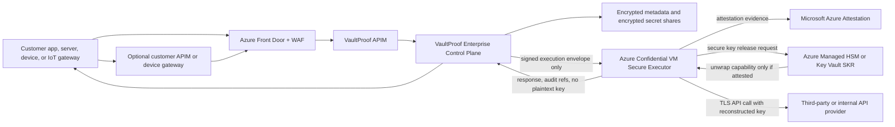
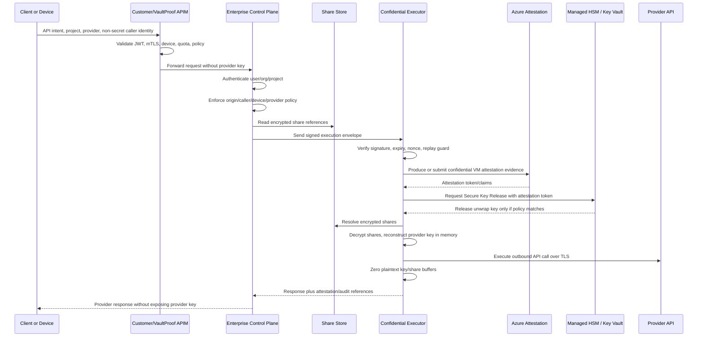

# VaultProof Enterprise Invention Disclosure Draft

Status: draft for patent counsel review
Date: 2026-04-26
Prepared for: VaultProof
Confidentiality: confidential attorney review draft, not public marketing copy

Important note: This document is a technical invention disclosure draft, not legal advice and not a patent application. Patent counsel should review inventorship, prior art, claim scope, filing strategy, and public disclosure timing before external demos or publication.

## 1. Short Title

Attested, policy-gated, secretless API execution for enterprise, device, and IoT clients using encrypted secret shares, confidential computing, secure key release, and customer-verifiable execution evidence.

## 2. Inventors And Ownership

Inventors to confirm with counsel:

- Nelson Yee
- Any additional human contributor who materially conceived the specific technical architecture, policy flow, attestation flow, encrypted-share flow, or caller-lock mechanism

Potential assignee:

- If VaultProof is not incorporated at filing time, file under the human inventor(s), then assign to the company after incorporation.
- If VaultProof is incorporated before filing, counsel can file with assignment to the company or record assignment after filing.

## 3. Technical Field

The invention relates to secure API credential management, confidential computing, cloud security, cryptographic key release, API gateways, device identity, and enterprise secretless execution.

More specifically, the invention relates to systems and methods for allowing applications, servers, customer gateways, and devices to cause third-party API calls to be performed without receiving or storing the underlying provider API keys. The system stores encrypted secret shares outside the execution runtime, validates enterprise policy before execution, releases unwrap capability only to an attested confidential runtime, reconstructs the provider secret only inside that runtime, performs the requested outbound API call, zeroes plaintext material, and emits audit or attestation evidence to support customer verification.

## 4. Background And Problem

Modern software increasingly depends on third-party APIs such as AI providers, payment processors, communications providers, developer tools, cloud services, data platforms, and internal enterprise APIs. These services typically require bearer tokens, API keys, signing secrets, or other long-lived credentials. Today, those credentials are commonly placed in application environment variables, CI/CD secret stores, runtime memory, mobile applications, edge workers, serverless functions, device firmware, or customer API gateways.

This creates several practical security problems:

- Application servers and serverless runtimes can expose provider keys through logs, debugging, memory inspection, crash reports, build artifacts, or compromised dependencies.
- Developers and operators may have access to secrets through dashboards, environment variables, secret managers, local `.env` files, or shell sessions.
- Enterprise customers often want centralized API governance through API Management, but customer gateways should not receive the third-party provider secrets they govern.
- Devices and IoT fleets need to call upstream services, but embedding provider keys in devices is high risk because devices can be lost, reverse engineered, cloned, or compromised.
- Traditional secret managers protect secrets at rest but typically release plaintext secrets to application memory when the application is authorized.
- Confidential computing can reduce memory exposure risk, but a confidential runtime claim is only meaningful when attestation, key release, and reconstruction boundaries are wired correctly.
- Existing API gateways typically route, authenticate, and rate limit traffic, but they do not prove that the underlying provider key was reconstructed only inside an attested confidential runtime.

The core problem is therefore not merely "encrypt the key." The problem is how to let a customer use any API or secret-backed service while preventing the customer application, customer gateway, VaultProof control plane, VaultProof operators, and ordinary cloud runtime administrators from obtaining the plaintext provider credential.

## 5. Summary Of The Invention

VaultProof Enterprise provides a secretless API execution architecture in which clients never receive provider credentials and the control plane never reconstructs them. Provider credentials are split and encrypted as shares. A public enterprise control plane handles authentication, organization/project policy, caller-lock enforcement, API lifecycle routing, and signed request creation. A secure executor receives only signed execution envelopes, obtains unwrap capability only through confidential-computing attestation and secure key release, decrypts and reconstructs the provider credential inside the trusted execution boundary, performs the upstream API call over TLS, zeroes plaintext material, and writes audit metadata without logging secrets.

The system supports:

- VaultProof-managed enterprise gateway mode.
- Customer-managed Azure API Management mode.
- Device and IoT gateway mode.
- Browser, server, device, IoT, gateway, and fleet client classes.
- Caller-lock policy based on origin, referer, customer gateway marker, device identity, fleet ID, firmware version, source CIDR, mTLS certificate thumbprint, mTLS certificate subject, and provider-specific overrides.
- Azure Confidential VM runtime with Microsoft Azure Attestation and Azure Secure Key Release.
- Azure Managed HSM `oct-HSM` AES-256 unwrap material for the highest-security production configuration.
- Customer-verifiable evidence bundles proving the execution path used an approved confidential runtime and approved key release policy.

The invention is not limited to AI API keys. It applies to any secret or API credential used to call a third-party or internal service, including payment APIs, communications APIs, cloud provider APIs, database credentials, webhook signing secrets, private model endpoints, internal enterprise APIs, device fleet credentials, and other bearer-token or key-based systems.

## 6. Core System Architecture



The architecture separates responsibilities:

- API Management routes and governs API traffic but does not possess provider keys.
- The control plane validates users, organizations, projects, provider slots, and caller-lock policy but does not possess unwrap keys.
- Storage contains encrypted shares, not usable plaintext provider keys.
- The confidential executor reconstructs only inside the confidential runtime and only after successful attestation and key release.
- Managed HSM or Key Vault releases unwrap capability only when attestation claims match an approved policy.

## 7. Detailed Execution Flow



Step-by-step operation:

1. A customer application, server, browser, device, IoT gateway, or fleet agent sends an API execution intent to VaultProof or to a customer-managed gateway that forwards to VaultProof.
2. The request contains project/provider identifiers, requested upstream method/path/body, and non-secret caller metadata. It does not contain the provider API key.
3. API Management may validate customer JWTs, mTLS certificates, products/subscriptions, quotas, request sizes, and rate limits.
4. The enterprise control plane authenticates the user or service, resolves organization/project authorization, locates the provider slot, and enforces caller-lock policy.
5. Caller-lock policy may require an approved origin, customer APIM marker, client class, device identity hash, fleet ID, firmware version, source IPv4/IPv6 CIDR, client certificate thumbprint, certificate subject, or provider-specific override.
6. If policy passes, the control plane creates a signed execution envelope containing the project ID, provider slot ID, method, path, sanitized headers, request body reference or body bytes, issue time, expiration time, nonce, and caller-lock context.
7. The secure executor verifies the envelope signature, expiration, and replay status. It rejects unsigned, expired, replayed, or malformed requests.
8. In production confidential mode, the executor obtains attestation evidence from inside an Azure Confidential VM and exchanges it through Microsoft Azure Attestation.
9. The executor requests secure key release from Azure Managed HSM or Key Vault. The release policy checks attestation claims, approved runtime measurement, secure boot/vTPM claims, build digest, and other configured evidence.
10. If and only if attestation passes, the HSM/key service releases unwrap capability to the executor.
11. The executor resolves encrypted secret shares from storage, decrypts them inside the confidential runtime, reconstructs the provider credential in memory, and immediately uses it to make the approved outbound API call.
12. Plaintext provider credentials are never returned to the client, APIM, control plane, logs, environment variables, or ordinary storage.
13. The executor zeroes plaintext buffers and records audit metadata, including request ID, provider, policy decision, attestation evidence reference, and key-release policy reference, without logging the secret.

## 8. Caller Lock And Policy Binding

Caller lock is a technical enforcement layer that binds secret reconstruction and API execution to approved calling contexts. Unlike a traditional origin check, caller lock can apply across browsers, servers, API gateways, device fleets, and IoT gateways.

Policy dimensions may include:

- Browser origin from `Origin`.
- Referer origin from `Referer`.
- Customer gateway marker such as `x-vaultproof-customer-gateway`.
- Client class such as browser, server, device, IoT, or gateway.
- Device identity hash derived from a device identifier.
- Fleet ID, facility ID, environment, or device group.
- Firmware or agent version.
- Source IPv4 or IPv6 CIDR.
- mTLS certificate thumbprint.
- mTLS certificate subject or subject fragment.
- Provider-specific overrides such as a stricter OpenAI policy than the general project policy.

Provider-specific override example:

```json
{
  "allowed_client_classes": ["server"],
  "provider_overrides": {
    "openai": {
      "allowed_customer_gateways": ["openai-apim"],
      "allowed_ip_cidrs": ["203.0.113.0/24"]
    },
    "stripe": {
      "allowed_customer_gateways": ["payments-apim"],
      "allowed_client_certificate_thumbprints": ["aabbccdd"]
    }
  }
}
```

In one implementation, the project-wide caller-lock policy must pass before any provider-specific override is evaluated. The provider-specific policy can therefore only further restrict execution; it does not loosen the base policy.

## 9. Customer-Managed APIM And Device Mode

The invention supports customers that already operate their own API lifecycle platform. In that model, customer Azure API Management validates customer-specific identity, subscriptions, products, quotas, rate limits, mTLS certificates, device JWTs, or IoT identity before forwarding to `enterprise.vaultproof.dev`.

The customer gateway still never receives the provider API key. It forwards only non-secret caller metadata and an approved request intent. VaultProof then performs its own organization/project authorization and dispatches to the confidential executor.

For IoT and device fleets:

- Devices authenticate to customer APIM, Azure IoT Hub, DPS, an edge gateway, or another customer identity layer.
- The gateway normalizes device identity into non-secret metadata.
- VaultProof policy can restrict execution by fleet, firmware, device identity requirement, certificate, source range, provider, or API route.
- Devices never store or receive provider keys.
- Offline devices queue intent rather than secrets.

This allows a customer to keep API lifecycle governance while VaultProof provides secretless execution and confidential reconstruction.

## 10. Threat Model

The system is designed to reduce or prevent plaintext provider credential exposure in the following scenarios:

- A client application is compromised and can only send API execution intents, not read provider keys.
- A device is stolen, cloned, or reverse engineered, but it does not contain third-party provider credentials.
- A customer APIM policy or gateway operator can route and observe metadata but cannot obtain provider secrets.
- A VaultProof control-plane operator, shell user, dashboard user, or application bug cannot access unwrap keys or reconstruct provider credentials.
- A database leak exposes encrypted shares but not the unwrap material or complete plaintext provider key.
- A normal cloud host or non-confidential runtime should not receive the final unwrap capability in production.
- A replayed execution envelope is rejected by nonce/request ID and expiration checks.
- An unapproved origin, gateway, source range, device class, firmware version, fleet, or certificate is denied before a secure execution envelope is dispatched.
- A customer can inspect an evidence bundle showing that attestation and secure key release participated in execution.

Threats not fully eliminated and requiring additional controls:

- Malicious or compromised provider APIs can still see the request sent to that provider.
- A compromised approved client identity may still cause permitted API calls until revoked or rate limited.
- Side-channel attacks against confidential computing hardware are reduced but not impossible.
- Vulnerabilities inside the executor code could affect execution if included in the approved measured build.
- Debug modes, permissive attestation policies, or environment-based demo keys must not be used for production security claims.
- Legal compulsion, cloud control plane abuse, or misconfigured access policies require operational and compliance controls in addition to technical design.

## 11. Customer-Verifiable Evidence Bundle

A notable feature is that VaultProof can provide a customer-verifiable evidence bundle for execution. The bundle may include:

- Execution request ID and timestamp.
- Provider slot and project reference.
- Executor build artifact digest.
- Confidential VM resource ID or identity.
- Microsoft Azure Attestation provider URI.
- Attestation token hash or signed attestation token.
- Selected vTPM, secure boot, and confidential VM claim summary.
- Managed HSM or Key Vault key ID and version.
- Secure Key Release policy hash.
- Caller-lock decision summary, such as gateway, client class, device/fleet, source range, and provider policy.
- Statement that plaintext provider key material was not returned or logged.

The evidence bundle helps distinguish a real confidential execution system from ordinary secret-manager access or marketing-only TEE claims.

## 12. What Makes VaultProof Different

VaultProof differs from conventional approaches in several ways:

- It is not just a vault. Traditional vaults often release plaintext secrets to authorized applications. VaultProof performs the API call without returning the secret to the application.
- It is not just an API gateway. API gateways route, authenticate, and rate limit, but generally do not reconstruct provider keys inside an attested confidential runtime.
- It is not just confidential computing. The confidential runtime is coupled to policy-gated request signing, encrypted share storage, Secure Key Release, and customer-verifiable evidence.
- It is not only for AI. The mechanism applies to all API keys and secrets, including payment, communications, database, cloud, internal service, and device fleet credentials.
- It supports customer-owned API governance. A customer can keep their own APIM and still avoid exposing provider secrets to that APIM.
- It supports devices and IoT. Device identity and fleet policy can gate execution while keeping provider credentials out of device firmware.
- It creates a separation of powers. The control plane can approve and audit but cannot decrypt; the executor can decrypt only after attestation; storage has encrypted shares only; APIM has governance only.
- It produces verifiable proof. Customers can receive evidence of the runtime, key release policy, and caller-lock decision tied to an execution request.

## 13. Potentially Novel Technical Concepts

Counsel should evaluate at least the following potential inventive concepts:

1. A method of performing secretless API execution where encrypted secret shares are stored outside a control plane, a control plane enforces caller policy and signs an execution envelope, and an attested confidential runtime reconstructs the provider credential only for an outbound API call.
2. A system in which Secure Key Release is conditioned on confidential runtime attestation and is further combined with project/provider caller-lock policy before secret reconstruction.
3. A provider-specific caller-lock policy model where a global project policy must pass and provider-specific overrides can add stricter gateway, device, certificate, source range, or client-class restrictions.
4. A customer-managed API gateway integration in which customer APIM governs identity, quotas, and observability without receiving the provider credential, while forwarding non-secret policy context to a confidential executor system.
5. A device and IoT execution model where device/fleet metadata gates reconstruction of third-party provider credentials without storing those credentials on the device or gateway.
6. A customer-verifiable evidence bundle associating a particular API execution with attestation claims, key-release policy, caller-lock decision, and a statement that plaintext provider credentials were not returned.
7. A replay-resistant signed execution envelope containing a request ID, nonce, expiration, provider slot, sanitized upstream request components, and caller-lock metadata, consumed only by a secure executor.
8. A split-secret and encrypted-share format where no single storage component, control-plane component, or gateway component possesses sufficient material to recover the provider credential outside the attested executor.

## 14. Example Claim Ideas For Counsel

These are not legal claims. They are technical claim prompts for counsel.

Independent method claim idea:

1. A computer-implemented method comprising: receiving, by a control plane, a request to perform an outbound API call using a provider credential; authenticating the request to an organization and project; enforcing a caller-lock policy associated with the project; generating a signed execution envelope comprising a provider slot identifier, sanitized request data, expiration data, replay-prevention data, and caller context; transmitting the signed execution envelope to a confidential execution runtime; verifying, by the confidential execution runtime, the signed execution envelope; obtaining attestation evidence from the confidential execution runtime; requesting release of unwrap material from a key service using the attestation evidence; receiving the unwrap material only when the attestation evidence satisfies a release policy; decrypting encrypted secret shares within the confidential execution runtime; reconstructing the provider credential within the confidential execution runtime; performing the outbound API call using the reconstructed provider credential; and deleting plaintext provider credential material from memory after the outbound API call.

Independent system claim idea:

2. A system comprising: an API management layer configured to route customer requests without provider credentials; a control plane configured to enforce organization, project, and caller-lock policy and to generate signed execution envelopes; encrypted share storage configured to store encrypted portions of provider credentials; a confidential execution runtime configured to verify signed execution envelopes and reconstruct provider credentials only after attested key release; and a key-release service configured to release unwrap material to the confidential execution runtime only when attestation claims match a release policy.

Provider-specific caller-lock claim idea:

3. The method of claim 1, wherein enforcing the caller-lock policy comprises enforcing a project-wide policy and enforcing a provider-specific override policy associated with a provider or provider slot, wherein the provider-specific override policy imposes additional restrictions on at least one of gateway identity, client class, device identity, fleet identity, firmware version, source network range, certificate thumbprint, or certificate subject.

Customer APIM claim idea:

4. The method of claim 1, wherein the request is received from a customer-managed API gateway that validates customer identity and rate limits the request, strips provider credential headers, forwards non-secret gateway metadata, and does not receive the provider credential before or after execution.

Device/IoT claim idea:

5. The method of claim 1, wherein the request originates from a device or IoT gateway, and the caller-lock policy requires a device identity or fleet identity before the confidential execution runtime reconstructs the provider credential.

Evidence-bundle claim idea:

6. The method of claim 1 further comprising generating an execution evidence bundle comprising an execution request identifier, confidential runtime identity, attestation token reference, key-release policy reference, provider slot reference, and caller-lock decision summary, while excluding plaintext provider credential material.

Replay-protection claim idea:

7. The method of claim 1, wherein the signed execution envelope includes a nonce and expiration time, and wherein the confidential execution runtime rejects an execution envelope when the nonce or request identifier has previously been used.

Encrypted-share claim idea:

8. The system of claim 2, wherein the encrypted share storage stores at least two encrypted secret shares, and wherein both shares must be decrypted inside the confidential execution runtime before the provider credential can be reconstructed.

## 15. Alternative Embodiments

The invention can be implemented with different cloud providers and hardware-backed confidential computing systems, provided that the design preserves the same security boundary. Examples include:

- Azure Confidential VM with Microsoft Azure Attestation and Azure Secure Key Release.
- Azure Managed HSM with `oct-HSM` symmetric unwrap keys for AES-256-style unwrap material.
- Azure Key Vault Premium for lower-friction prototype key-release plumbing.
- Other confidential computing systems with remote attestation and hardware-rooted key release.
- Different API lifecycle platforms besides Azure API Management.
- Different secret-sharing schemes, threshold policies, or envelope encryption schemes.
- Synchronous execution, asynchronous job execution, streaming execution, or batch execution.
- Provider credentials, signing keys, webhook secrets, database credentials, internal API tokens, or short-lived derived provider credentials.
- Dedicated tenant deployments, customer-hosted deployments, hybrid deployments, or private network deployments.

The preferred production embodiment for VaultProof Enterprise is Azure-only: Azure Front Door, Azure API Management, Azure Confidential VM, Microsoft Azure Attestation, Azure Managed HSM Secure Key Release, and VaultProof enterprise control plane.

## 16. Known Prior Art Categories To Search

Counsel should search and compare against:

- Cloud secret managers and vault systems.
- API gateways and service meshes.
- API proxy systems that inject credentials.
- Confidential computing secret-release systems.
- Azure Secure Key Release and Microsoft Azure Attestation examples.
- Shamir secret-sharing credential storage systems.
- Split-key or threshold-decryption API proxy systems.
- Keyless TLS and signing-service architectures.
- Device gateway and IoT credential proxy systems.
- Zero trust API access and workload identity systems.

Initial differentiation to investigate:

- Whether prior systems combine caller-lock policy, customer APIM integration, encrypted secret shares, confidential runtime reconstruction, secure key release, provider API execution, replay-resistant signed envelopes, and customer-verifiable evidence in a single workflow.
- Whether prior systems support provider-specific policy overrides that can only tighten the project-wide policy before attested reconstruction.
- Whether prior systems support device/IoT API execution without exposing provider credentials to devices or customer gateways.

## 17. Implementation Status

Implemented prototype components:

- Enterprise control plane running separately from the B2C Cloudflare path.
- `enterprise.vaultproof.dev` routed through Azure Front Door.
- Azure Container Apps prototype control plane and executor.
- Signed execution envelope between control plane and executor.
- Encrypted `share1_encrypted` and `share2_encrypted` support.
- Demo versus confidential executor mode.
- Replay guard for signed execution envelopes.
- Caller-lock policy based on origins, gateways, client class, device identity, fleet, firmware, IPv4/IPv6 CIDR, mTLS certificate thumbprint, mTLS certificate subject, and provider-specific overrides.
- Executor support for Azure Secure Key Release response parsing and attestation evidence references.
- Customer-managed APIM policy examples.
- Device/IoT APIM policy example.
- Azure secure-runtime infrastructure draft for Confidential VM, attestation, and key-release resources.

Production work still required:

- Deploy Confidential VM executor.
- Bind executor to private networking.
- Configure Azure Managed HSM `oct-HSM` AES-256 unwrap key.
- Pin Secure Key Release policy to real Azure attestation claims.
- Disable demo unwrap key paths for production.
- Add production evidence bundle output and customer verification tooling.
- Add UI for caller-lock and provider override policy.
- Add Microsoft Entra ID SSO and enterprise audit export.

## 18. DIY Provisional Filing Plan

Goal: file a U.S. provisional patent application quickly enough to establish an early filing date before detailed customer demos, public architecture posts, investor decks containing implementation details, or open-source publication of the enterprise confidential-execution design.

This plan is intended for a founder filing without counsel. The safer path is still attorney review before filing, but this workflow is specific enough to file a usable provisional if speed matters.

### Filing Package To Prepare

Prepare one main PDF named:

```text
VaultProof-Enterprise-Provisional-Specification.pdf
```

The PDF should include:

- Title: "Attested, Policy-Gated, Secretless API Execution Using Confidential Runtime Key Reconstruction"
- Inventor section listing the exact human inventor names and residences
- Technical field
- Background/problem
- Summary
- Architecture diagrams
- Detailed execution flow
- Caller-lock policy details
- Customer-managed API gateway mode
- Device and IoT mode
- Threat model
- Customer-verifiable evidence bundle
- Alternative embodiments
- Example technical claim ideas
- Implementation status

Prepare optional drawing PDFs if Patent Center asks for separate drawings:

```text
VaultProof-Enterprise-Figures.pdf
```

Suggested figures:

- Figure 1: Overall system architecture
- Figure 2: Detailed execution sequence
- Figure 3: Caller-lock policy enforcement flow
- Figure 4: Customer-managed APIM mode
- Figure 5: Device and IoT mode
- Figure 6: Attestation and Secure Key Release flow
- Figure 7: Customer evidence bundle contents

Prepare one local folder for filing artifacts:

```text
docs/ip/filing/
```

Store in that folder:

- final specification PDF
- final figures PDF, if separate
- USPTO filing receipt
- application number confirmation
- payment receipt
- any submitted cover sheet or ADS PDF
- calendar reminder text for the 12-month non-provisional deadline

### What To Include In The Specification

Include enough detail that a patent attorney can later write claims covering the real invention without adding unsupported new matter.

Must include:

- The control plane never receives provider key plaintext.
- API Management routes, authenticates, rate limits, and observes, but does not receive provider keys.
- Provider credentials are stored as encrypted shares.
- The secure executor accepts only signed execution envelopes.
- The execution envelope includes request ID, nonce, expiration, provider slot, sanitized request fields, and caller-lock context.
- Replay protection rejects repeated request IDs or nonces.
- Production unwrap material is released only after confidential runtime attestation.
- The preferred production embodiment uses Azure Confidential VM, Microsoft Azure Attestation, Azure Secure Key Release, and Azure Managed HSM `oct-HSM` AES-256 unwrap material.
- Secret reconstruction occurs only inside the confidential runtime.
- Plaintext key material is used only for the outbound API call and then zeroed.
- Caller-lock policy can restrict by origin, referer, gateway marker, client class, device identity, fleet, firmware, IPv4/IPv6 CIDR, mTLS thumbprint, mTLS subject, and provider-specific overrides.
- Customer-managed APIM can forward non-secret identity and policy context without receiving provider secrets.
- Device and IoT flows keep provider credentials out of firmware and devices.
- Customer evidence can include runtime, attestation, key-release, caller-lock, and audit references.

Should include:

- At least one concrete OpenAI-style example.
- At least one non-AI example, such as Stripe, Twilio, AWS, database, or internal API credential.
- At least one device or IoT example.
- At least one customer-managed APIM example.
- Both VaultProof-managed and customer-managed gateway modes.
- Alternative cloud and hardware embodiments, while identifying Azure as the preferred production embodiment.

Do not include:

- Real customer names.
- Real API keys, tokens, Supabase tokens, OAuth tokens, Azure secrets, or signing secrets.
- Private credentials from `.env` files.
- Full source code dumps unless counsel specifically asks.
- Claims that the production TEE is finished if only the Container Apps demo is deployed.
- Marketing promises such as "impossible to hack" or "guaranteed zero breach."

### Quality Gate Before Filing

Before uploading to Patent Center, confirm every answer is "yes":

- Does the document describe how to make and use the invention, not just the business idea?
- Does it explain why ordinary secret managers and API gateways are not enough?
- Does it show where plaintext provider key material can and cannot exist?
- Does it explain the exact relationship between control plane, APIM, storage, confidential executor, attestation, and key release?
- Does it include diagrams for the architecture and execution sequence?
- Does it include the caller-lock fields and provider-specific overrides?
- Does it include customer-managed APIM and device/IoT embodiments?
- Does it explain evidence bundles and customer verification?
- Does it include alternatives broad enough to avoid limiting the invention to only OpenAI or only Azure Container Apps?
- Does it avoid real secrets and customer confidential information?
- Are all actual human inventors listed?
- Is the filing date being obtained before public disclosure of the detailed architecture?

### USPTO Filing Steps

1. Create or sign into a USPTO account.
2. Open USPTO Patent Center.
3. Start a new provisional utility patent application.
4. Select provisional application, not non-provisional.
5. Enter the invention title.
6. Enter each inventor's legal name and residence.
7. Enter the correspondence address.
8. Indicate whether any U.S. government agency has rights. For VaultProof, this should likely be "no" unless grant/government funding applies.
9. Upload the provisional specification PDF.
10. Upload separate figures PDF if figures are not embedded in the specification.
11. Complete the provisional cover sheet or Application Data Sheet if Patent Center prompts for it.
12. Select small entity or micro entity status only if you truly qualify.
13. Pay the required provisional filing fee.
14. Download and store the filing receipt.
15. Save the application number and confirmation number.
16. Add "Patent Pending" only after the filing receipt is received.
17. Create calendar reminders for 9 months, 10 months, 11 months, and 12 months after filing.

### Filing Entity Decision

If VaultProof is not incorporated:

- File with the human inventor(s) as applicant/inventor.
- Keep records showing the invention belongs to the founder(s).
- After incorporation, execute an IP assignment from inventor(s) to the company.
- Store the signed assignment with company records.

If VaultProof is incorporated before filing:

- File with the company as applicant if appropriate.
- Still list the human inventor(s).
- Execute or record assignment as counsel recommends.

Do not list a company, AI system, contractor, or advisor as an inventor unless a patent attorney confirms the correct role. Inventors are human contributors to conception of the claimed invention.

### Timeline After Filing

Day 0:

- File the provisional.
- Save receipt and application number.
- Mark internal materials as patent pending.

Within 7 days:

- Create a private folder for patent records.
- Save the exact filed PDF and receipt.
- Write down any public disclosures that happened before filing.
- Stop sharing detailed architecture publicly unless intentional.

Within 30 days:

- Ask a patent attorney for a fixed-fee review of the filed provisional and invention strategy.
- Start a prior-art search focused on secretless API proxies, confidential computing key release, API gateways, and split-secret credential systems.

By month 6:

- Decide whether this is worth converting to a non-provisional.
- Update the invention disclosure with any improvements implemented after the provisional filing.
- Consider filing a second provisional for new improvements if the architecture materially changes.

By month 9:

- Engage counsel for non-provisional drafting if proceeding.
- Decide whether to pursue international/PCT strategy.

By month 12:

- File the non-provisional claiming priority to the provisional, or accept that the provisional expires.
- Do not miss this deadline. A provisional does not become a patent by itself.

### Estimated DIY Cost

Expected cash cost if filing yourself:

- USPTO provisional filing fee: check current USPTO fee schedule at filing time.
- Micro entity may receive the largest discount if qualified.
- Small entity may receive a discount if qualified.
- Attorney cost: zero for DIY filing, but later non-provisional attorney work can still be several thousand to tens of thousands of dollars depending on complexity.

### Recommended Practical Strategy

For VaultProof, the practical path is:

1. File a detailed DIY provisional before broad public disclosure if attorney timing is too slow.
2. Use the invention disclosure in this document as the core specification.
3. Include diagrams and the strongest technical implementation details.
4. Avoid publishing this document publicly.
5. Use a patent attorney before the non-provisional.
6. File follow-on provisionals for meaningful improvements, especially production attestation evidence, Managed HSM policy binding, customer verification tooling, and device/fleet enforcement.

## 19. Public Disclosure Guidance

Before filing a provisional application, avoid publicly disclosing implementation details that are not already public, especially:

- The exact encrypted-share and unwrap flow.
- The signed execution envelope fields.
- Provider-specific caller-lock enforcement logic.
- Attestation evidence bundle structure.
- Secure Key Release policy binding details.
- Customer APIM and device gateway policy flow.

Public demos before filing should use high-level language such as "secretless API execution" and "confidential-computing backed enterprise mode" without publishing the full architecture, code paths, diagrams, or claim-like details.

## 20. One-Sentence Invention Summary

VaultProof Enterprise enables applications, customer gateways, and devices to use third-party APIs without receiving provider secrets by enforcing caller policy in a control plane, releasing unwrap capability only to an attested confidential runtime, reconstructing encrypted secret shares only inside that runtime for a single outbound API call, zeroing plaintext material, and producing customer-verifiable execution evidence.
